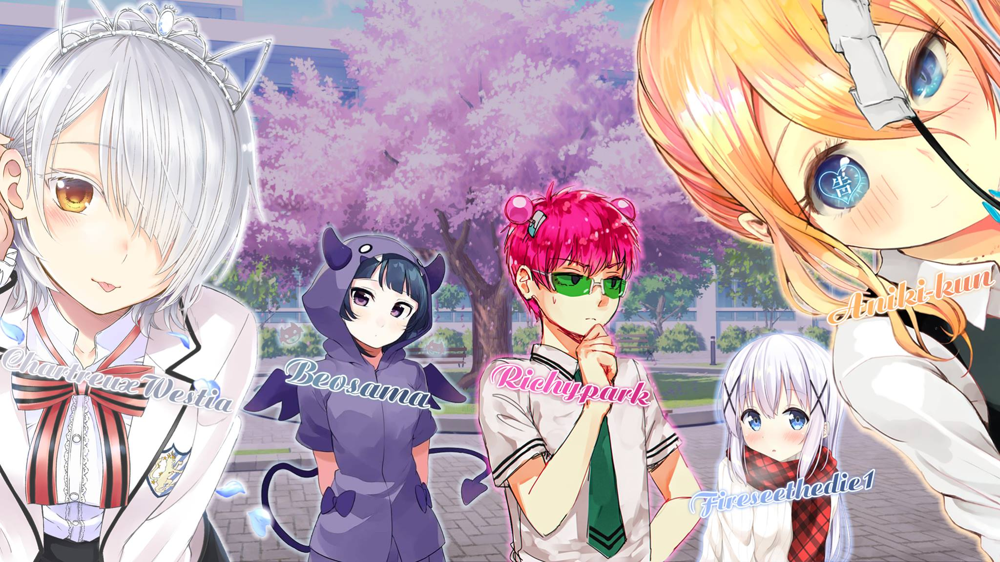
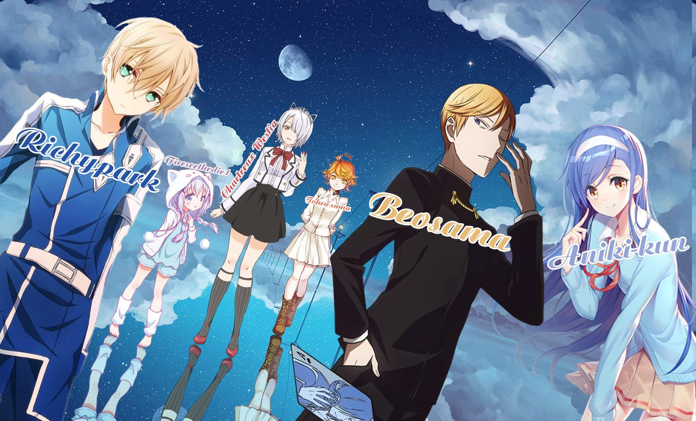

### Chào 👋, tớ là Vũ Nguyễn Thành Tâm hay được biết với cái tên [CatalizCS](https://github.com/catalizcs)

Hiện tại mình là một học sinh **THPT👨🏼‍💼** và làm việc cho project **[Mirai](https://github.com/catalizcs/mirai)**

	

**giới thiệu về bản thân:**

 - Tên thật của mình là: **Vũ Nguyễn Thành Tâm**
 - Mình vẫn đang là một học sinh **THPT**
 - Tất cả biệt danh của mình từng được đặt: **CatalizCS, Fireseethedie1, RFEChinoNguyen, ...**
 - Sinh vào: **20/11/2003**
 - Có chiều cao: **1 mét 84(năm 2020)**
 - Tính cách có hơi **trầm lặng** và **nhút nhát**, rất **khó** trong việc giao tiếp với mọi người
 - Mình là **Founder, Author, Developer** của project [Mirai](https://github.com/catalizcs/mirai) và cùng làm việc với người anh em [SpermLord](https://github.com/spermlord)

**Các sở thích khác người của mình:**

 - Thường xuyên nghe nhạc vào ban đêm
 - Chơi các tựa game: **[CS:GO](https://steamcommunity.com/id/catalizcs), [Osu!](https://osu.ppy.sh/users/11161495)**
 - Hay trashtalk với chú Nghĩa cùng đồng bọn xD
 - Hay chill vào buổi đêm khuya uwu
 - Rất hay **try hard** một vấn đề nào đấy

**Liên hệ:**
 
 - 👉🏻 Facebook: [Vũ Nguyễn Thành Tâm](https://fb.me/catalizcs)
 - 👉🏻 Youtube Channel: [CatalizCS](https://www.youtube.com/channel/UCugBpv0A_RdR61WedXukHZQ)
 - 👉🏻 Email: [catalizcs@gmail.com](mailto:catalizcs@gmail.com)
 - 👉🏻 Github: [CatalizCS](https://github.com/catalizcs)
 - 👉🏻 Website: [CatalizCS Website](https://catalizcs.hdesport.ga)
 - 👉🏻 Glitch Profile: [CatalizCS Profile](https://glitch.com/@catalizcs)
 - 👉🏻 Steam Profile: [CatalizCS Profile](https://steamcommunity.com/id/catalizcs)
 - 👉🏻 Osu! Profile: [Tama-sama Profile](https://osu.ppy.sh/users/11161495)

**:zap: Các hoạt động gần đây:**

<!--START_SECTION:activity-->
1. ❗️ Closed issue [#5](https://github.com/miraiPr0ject/miraiv2/issues/5) in [miraiPr0ject/miraiv2](https://github.com/miraiPr0ject/miraiv2)
2. 🗣 Commented on [#5](https://github.com/miraiPr0ject/miraiv2/issues/5) in [miraiPr0ject/miraiv2](https://github.com/miraiPr0ject/miraiv2)
3. 🗣 Commented on [#5](https://github.com/miraiPr0ject/miraiv2/issues/5) in [miraiPr0ject/miraiv2](https://github.com/miraiPr0ject/miraiv2)
4. ❌ Closed PR [#4](https://github.com/miraiPr0ject/miraiv2/pull/4) in [miraiPr0ject/miraiv2](https://github.com/miraiPr0ject/miraiv2)
5. 🎉 Merged PR [#3](https://github.com/miraiPr0ject/miraiv2/pull/3) in [miraiPr0ject/miraiv2](https://github.com/miraiPr0ject/miraiv2)
<!--END_SECTION:activity-->

**Github Stats**

 

**Osu!**

	<strong>NO NAME</strong>
	

	
<strong>Old Team's Collab</strong>

  

	<strong>2/9/2018</strong>
	
	<strong>3/11/2018</strong>
	
	<strong>9/3/2019</strong>
	
	<strong>29/4/2019</strong>
	

